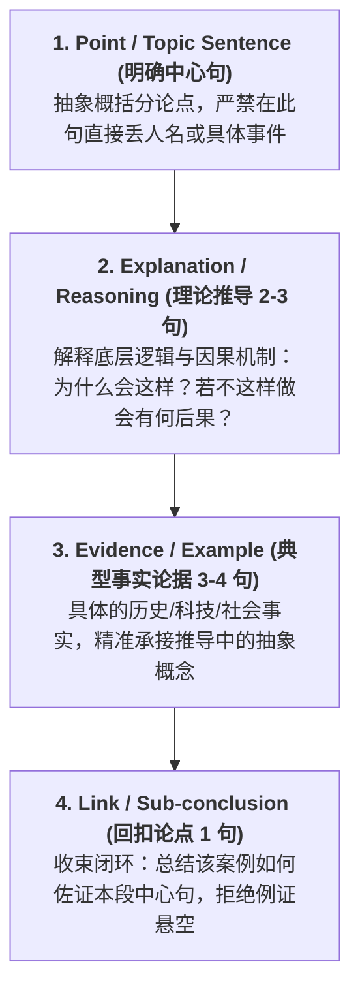

# GRE Issue 4.0 两天速成备考指南
> **基于《Issue 范文精析 —— 路莎老师 2025》核心理论与批注重构**  
> **核心目标**：不追求生僻华丽词汇，以“严密逻辑骨架（PEEL）+ 零语法错误平实句式 + 跨话题万能素材库”在 2 天内稳定斩获 GRE Issue 4.0 分。

---

## 导航目录
1. [Day 1 核心心法：4.0 分的标准与黄金段落逻辑骨架](#一day-1-核心心法40-分的标准与黄金段落逻辑骨架)
2. [高频理论推导句库（按 5 大逻辑主题分类）](#二高频理论推导句库按-5-大逻辑主题分类)
3. [【脑中中文分析】与【考场平实地道英文句】双语对照速查表](#三脑中中文分析与考场平实地道英文句双语对照速查表)
4. [范文 10 大万能核心案例深度提炼与跨话题多角度拆解](#四范文-10-大万能核心案例深度提炼与跨话题多角度拆解)
5. [路莎老师独家“考场避坑心法与 30 分钟实战策略”](#五路莎老师独家考场避坑心法与-30-分钟实战策略)

---

# 一、Day 1 核心心法：4.0 分的标准与黄金段落逻辑骨架

### 1. 为什么托福/雅思写法在 GRE 中只能拿 3.0-3.5 分？
* **托福雅思模式**：论点（TS） $\rightarrow$ 举例子（开始讲故事：谁、什么时候、发生什么） $\rightarrow$ 得出结论。这种写法在 GRE 考官眼中属于**缺乏批判性推理（Lack of Critical Reasoning）**。
* **GRE 4.0 分本质**：GRE Issue 考查的根本不是英语词汇量，而是**思维与推理链条（Reasoning & Logic）**。托福级别的平实词汇 + 严密的因果推导，足以拿到 4.0-4.5 分！

### 2. 核心段落黄金四步闭环（PEEL / CECL 骨架）
每个正文核心段必须严格由 **4 个部分** 构成，缺一不可：

* **[Step 1 中心句]**：1 句话，直接亮明分论点，从宏观维度定调（对个人、对社会、对学术发展等）。
* **[Step 2 理论推导]**：**4.0 分的最关键分水岭！** 必须写 2-3 句。从因果关系、制度运行、人性心理或社会常理角度，解释“为什么该主张成立”。
* **[Step 3 典型事实案例]**：3-4 句。写出具体的历史人物、政策、科学研究或社会现象，用事实呼应 Step 2 中的推导逻辑。
* **[Step 4 回扣总结]**：1 句。用 `Thus, this case demonstrates that...` 将案例拉回段落中心，形成完美自洽闭环。

---

# 二、高频理论推导句库（按 5 大逻辑主题分类）

> **备考用法**：考场上写不出理由时，直接套用对应主题的理论推导句式。这些句子全部提炼自路莎老师精析范文，词汇平实自然、逻辑因果链极强。

### 主题 1：政府职能、公共资源分配与机会成本 (Issue 24, 70, 41)
* **推导核心 1（公共利益的优先级与界限）**：
  > *Admittedly, certain public objectives, such as public health, basic education, and public safety, are so essential to the survival of a society that the government has a primary duty to ensure they are met. However, this duty should not be extended tenuously to areas where private initiative is more effective.*  
  > （诚然，公共健康、基础教育与安全等目标对社会生存至关重要，政府有首要职责确保其实现；然而，这一职责不应牵强地延伸至私营部门更有效的领域。）
* **推导核心 2（政府资源分配的主观性与不公）**：
  > *Inadequate public resources inevitably call for restrictions, priorities, and difficult choices. It is unconscionable to relegate normative decisions about which projects are more valuable or deserving to a small group of officials, whose decisions might be misguided by political agendas or lobbying.*  
  > （有限的公共资源必然要求限制、优先级和艰难抉择。将决定哪些项目更有价值的规范性权力交给少数官员是极不合理的，其决策极易受到政治议程或游说集团的误导。）
* **推导核心 3（科研/大型项目的机会成本）**：
  > *Expensive initiatives always carry significant opportunity costs in terms of how public funds might otherwise be used. Every dollar poured into speculative programs is a dollar diverted away from addressing pressing, immediate social crises that do not require experimental investigation.*  
  > （高昂的项目总伴随着巨大的机会成本。投向不可预测项目的每一分钱，都是从解决迫在眉睫且无需实验研究的眼前社会危机中抽调走的资金。）

---

### 主题 2：科学探索、未知后果与技术工具属性 (Issue 24, 52)
* **推导核心 1（科研探索的本质即不可预测性）**：
  > *Scientific research, by its very nature, is the exploration of uncharted and unpredictable territory. To prohibit research simply because its outcomes are not immediately clear is to defeat the purpose of scientific inquiry, since breakthroughs that alter human life are rarely anticipated at their inception.*  
  > （科学研究的本质就是探索未知和不可预测的领域。仅仅因为结果不明而禁止研究，恰恰违背了科学探索的初衷，因为改变人类生活的重大突破在刚开始时极少能被预先洞悉。）
* **推导核心 2（工具属性 vs. 人类主观意志）**：
  > *Machines and technical systems are fundamentally tools created to serve human purposes. While machines vastly outperform human beings in computational speed, consistency, and data storage, they inherently lack autonomous volition, emotional intelligence, and moral discernment.*  
  > （机器与技术系统从本质上是服务于人类目的的工具。尽管机器在计算速度、稳定性和数据存储上远超人类，但它们内在匮乏自主意志、情商以及道德辨别力。）
* **推导核心 3（技术的双刃剑取决于使用者而非技术本身）**：
  > *The societal consequences of any technological innovation depend far less on the scientific discovery itself than on the political and ethical choices made by those who deploy it. Punishing or halting pure inquiry fails to address the human factors that determine whether technology harms or benefits society.*  
  > （任何技术创新的社会后果，远不取决于科学发现本身，而取决于应用者的政治与伦理抉择。惩罚或中止纯粹的科学探索，无法解决决定科技究竟造福还是危害社会的人为因素。）

---

### 主题 3：历史借鉴、人性法则与社会决策 (Issue 45, 60)
* **推导核心 1（人性恒定与道德立法的徒劳性）**：
  > *Through the study of history, we come to realize that basic human nature—including human desires, motives, fears, and foibles—has remained remarkably constant across recorded time. One enduring lesson is the futility of attempting to legislate morality, as people naturally resist having subjective moral standards coerced upon them.*  
  > （通过研读历史，我们认识到基本人性——包括欲望、动机、恐惧和人性的弱点——在整个人类记载中惊人地恒定。一个持久的教训是企图通过立法规范道德纯属徒劳，因为人们天生抗拒被强加主观的道德准则。）
* **推导核心 2（历史不是万灵药，社会顽疾具有持久性）**：
  > *History offers few foolproof panaceas for modern policymaking. Major social problems—such as crime, poverty, and prejudice—are as old as organized society itself; historical precedents provide alternate ways of coping with and mitigating these ills, but rarely provide definitive cures.*  
  > （历史极少为现代决策提供万灵药。诸如犯罪、贫困和偏见等重大社会问题与人类社会本身一样古老；历史先例为我们应对和缓解这些弊病提供了替代思路，但鲜能提供根治之策。）
* **推导核心 3（文化演进与文明反思）**：
  > *Recognizing the profound differences in beliefs, customs, and social structures between past societies and our own helps us cultivate enlightened, tolerant values. It prevents cultural complacency by reminding us that contemporary practices are not absolute, but merely stages in ongoing human evolution.*  
  > （认识到过去社会与当今在信仰、风俗与社会结构上的巨大差异，有助于我们培养开明、包容的价值观。它通过提醒我们当代的惯例并非绝对真理而只是人类进化中的一个阶段，从而防止文化自满。）

---

### 主题 4：教育目的、通识培养与行为激励机制 (Issue 40, 86)
* **推导核心 1（教育的全面本质超越专业训练）**：
  > *True education amounts to far more than acquiring professional proficiency in a single specialized field. A comprehensive curriculum fosters self-understanding, civic responsibility, and tolerance for divergent viewpoints—capacities essential for meaningful participation in modern democratic society.*  
  > （真正的教育绝不仅限于在某一专门领域获得职业技能。全面的课程体系培养自我认知、公民责任以及对多元视角的宽容——这些都是在现代民主社会中有意义参与的核心能力。）
* **推导核心 2（跨学科融合与视野拓展）**：
  > *Intellectual mastery in any modern discipline inevitably requires insights from adjacent fields. Complex real-world challenges do not respect academic boundaries; solving them demands professionals who can synthesize methodologies from different domains.*  
  > （在任何现代学科中取得真正的精深，必然需要相邻领域的洞见。现实世界的复杂挑战不分学科边界；解决这些挑战需要能够综合不同领域研究方法的专业人才。）
* **推导核心 3（激励与约束的平衡：过度奖惩的弊端）**：
  > *While positive reinforcement effectively bolsters confidence and nurtures curiosity, indiscriminate praise breeds complacency and undermines self-discipline. Conversely, ignoring detrimental conduct allows minor errors to calcify into persistent, destructive habits.*  
  > （正向激励能有效增强信心并呵护好奇心，但无原则的盲目表扬会导致自满并削弱自律。相反，对不良行为完全无视，会使微小的过失固化为根深蒂固的破坏性恶习。）

---

### 主主题 5：价值衡量、手段正当性与领域认知 (Issue 29, 37, 41)
* **推导核心 1（崇高目标不能豁免手段的伦理底线）**：
  > *The worthiness of an objective cannot be evaluated in isolation from the costs, risks, and collateral damage incurred in pursuing it. When the means chosen infringe upon fundamental ethical norms or cause disproportionate harm, the integrity of the goal itself is irrevocably compromised.*  
  > （一个目标的价值绝不能脱离追求它时所付出的代价、风险和连带损害而单独评估。若所选手段侵犯了基本伦理准则或造成了不成比例的伤害，目标本身的崇高性便会荡然无存。）
* **推导核心 2（不同领域成就认可的时间维度差异）**：
  > *The timeline for validating human greatness varies drastically across disciplines. In the arts, work can often be appreciated at face value based on immediate emotional and aesthetic resonance. In theoretical sciences, however, an innovative paradigm must withstand prolonged empirical testing and replication before its historical significance can be confirmed.*  
  > （人类伟大成就的验证周期在不同领域截然不同。在艺术领域，作品往往凭直观的情感与审美共鸣即可在当下获得鉴赏；然而在理论科学中，创新的理论范式必须经受长期的实证检验与重复验证，其历史意义才能得以确认。）
* **推导核心 3（建设性分歧推进认知与社会共识）**：
  > *Human knowledge expands far more through intellectual friction with dissenting voices than through safe reinforcement within like-minded circles. Confronting well-reasoned opposition forces individuals to re-examine unstated assumptions, eliminate blind spots, and refine their own arguments.*  
  > （与持异见者的智识碰撞所带来的认知拓展，远胜于在志同道合圈子里的安全抱团。面对有理有据的反对意见，会迫使人们重新审视未经验证的前提假设、消除盲点，并完善自身的论证。）

---

# 三、【脑中中文分析】与【考场平实地道英文句】双语对照速查表

> **速成心法**：严禁在考场上临场生造长难句！用以下平实、清晰、**主谓明确**的结构，直接将中文思考转换为零语病考场句。

| 论证功能 | 脑中常想的中文分析（考生直觉） | 考场平实高分地道英文（0语法陷阱） | 避坑要点与语法心法 |
| :--- | :--- | :--- | :--- |
| **提出中心句** | 这个说法太绝对了，必须分情况讨论。 | *While this claim has some merit in certain situations, it is overly broad and requires a case-by-case analysis.* | 杜绝写 `In my opinion, I think...` 重复啰嗦；用 `case-by-case` 高度地道。 |
| **界定主体职责** | 政府的核心职责是保障公共安全，而不是资助个人喜好。 | *The primary role of the government is to safeguard public welfare rather than sponsor subjective individual preferences.* | `safeguard public welfare` 简洁平实，比中式长难表达更稳。 |
| **解释因果机制** | 如果不限制这种情况，资源就会被浪费在没有意义的项目上。 | *Without reasonable boundaries, limited resources would be squandered on speculative or unproductive projects.* | 用 `Without + 抽象名词` 引导假设，主句用 `would be + 过去分词`，避免 if 句产生悬空。 |
| **推导机会成本** | 把钱花在这个地方，就意味着没有钱去解决其他更紧急的民生问题。 | *Allocating enormous funds to this area entails significant opportunity costs, leaving urgent social problems underfunded.* | 使用伴随状语 `, leaving... underfunded`，因果与后果一目了然。 |
| **阐述探索本质** | 科学研究本来就是不可预测的，我们不可能提前知道结果。 | *Scientific research is inherently uncertain; one cannot possibly anticipate all outcomes prior to thorough experimentation.* | 杜绝口语 `we cannot know before doing it`；用分号衔接两个独立分句，防止连词缺失。 |
| **对比机器与人** | 机器虽然算得快，但是缺乏道德感和真正的同理心。 | *Although machines excel at repetitive tasks and data processing, they remain incapable of genuine empathy and moral reasoning.* | 用 `Although A excels at X, they remain incapable of Y` 形成完美平实对比。 |
| **引入事实案例** | 最能说明这个道理的例子，就是美国历史上的禁酒令。 | *A telling illustration of this principle is the American Prohibition in the 1920s.* | 杜绝写 `For example, I will talk about...`；用 `A telling illustration of... is...` 高级自然。 |
| **陈述案例结果** | 这项政策最后不仅没有消除酗酒，反而导致了黑市猖獗和黑帮犯罪。 | *This policy not only failed to curb drinking, but also catalyzed rampant black-market activities and organized crime.* | `not only... but also...` 严格平行；动词用 `catalyzed`（催生），避免用流水账式的 and。 |
| **回扣中心论点** | 这个例子清楚地证明了：用法律手段强制推行道德准则是行不通的。 | *This historical lesson clearly demonstrates that attempting to enforce subjective morality through law is ultimately futile.* | 总结句直接呼应段落 TS，名词从句 `that attempting to... is futile` 结构严谨闭环。 |
| **展开严密让步** | 诚然，我们不能完全否认这种做法在短时间内能带来一些好处。 | *Admittedly, this approach may yield some short-term benefits under specific circumstances.* | 让步段开头直接用 `Admittedly`，简练沉稳。 |
| **转折夺回立场** | 但是，如果把这种做法推向极端，其长期危害将远远超过眼前的收益。 | *However, when carried to an extreme, its long-term perils will far outweigh its immediate gains.* | 核心转折句式：`when carried to an extreme, the perils will far outweigh the gains`。 |
| **提出最终建议** | 因此，我们不能走极端，而必须在两相权衡中找到合理的平衡点。 | *Therefore, instead of adopting a rigid policy, decision-makers must strike a delicate balance between these competing interests.* | 结尾黄金动词短语：`strike a delicate balance between A and B`。 |

---

# 四、范文 10 大万能核心案例深度提炼与跨话题多角度拆解

> **速成法则**：GRE Issue 题库虽然多，但**高频核心案例是通用的**。吃透范文中这 10 个代表性例证，就能通过变换切入角度，无缝覆盖 80% 以上的高频题库！

---

### 案例 1：里根政府“星球大战计划”（Strategic Defense Initiative - SDI）
* **【范文出处】**：Issue 24（政府不应资助后果不明的研究）
* **【核心事实摘要】**：20 世纪 80 年代里根政府耗资数千亿美元研发外太空激光拦截核弹系统。然而该技术在当时高度不成熟、收益虚无，最终项目无疾而终（debacle），导致联邦巨额赤字；而当时美国的街头帮派暴力、艾滋病教育普及、缺乏课后关照的儿童福利等紧迫社会问题却因资金匮乏而陷入困境。
* **【提炼核心概念】**：`Opportunity Cost（机会成本）`, `Speculative vs. Immediate Needs（虚无投机 vs. 迫切民生）`, `Misallocation of Taxpayer Funds（公共资金错配）`。
* **【跨话题多角度套用示范】**：
  * **角度 A：科技/科研资助话题（Issue 24）**
    * *切入点*：作为让步段论据——并非所有科研都应无限制资助，目标过于模糊和投机的项目会造成社会资源灾难。
    * *考场速用句*：*The Reagan administration's "Star Wars" defense initiative in the 1980s illustrates that pouring immense public wealth into technologically speculative ventures can drain resources needed for tangible crises like public health and education.*
  * **角度 B：政府开支与大城市支持话题（Issue 70）**
    * *切入点*：政府财政具有有限性，应当优先保障公共安全与市政基础设施，而非盲目投入华而不实的项目。
    * *考场速用句*：*Just as the exorbitant expenditures on the Star Wars initiative impoverished domestic social programs, allocating public funds to non-essential municipal cultural agendas inevitably diverts funds from urgent urban infrastructure.*
  * **角度 C：崇高目标与手段权衡话题（Issue 41）**
    * *切入点*：国家安全的目标固然崇高，但不能以透支公共财政、牺牲底层民众福利为代价。

---

### 案例 2：美第奇家族与近现代工业/科技慈善家（The Medici Family & Carnegie, Gates）
* **【范文出处】**：Issue 70（政府资助大城市以繁荣文化）
* **【核心事实摘要】**：文艺复兴时期意大利佛罗伦萨的美第奇家族（Medici family）作为私人银行资本，资助了米开朗基罗（Michelangelo）和拉斐尔（Raphael），造就了文化繁荣。20 世纪工业巨头卡内基（Carnegie）、洛克菲勒（Rockefeller）、盖蒂（Getty）设立私人基金会建立图书馆、大学和博物馆。当今盖茨（Bill Gates）、特纳（Ted Turner）以科技资本推动全球文化与公益。
* **【提炼核心概念】**：`Private Patronage（私人赞助）`, `Philanthropy（民间慈善）`, `Autonomy of Arts and Sciences（文化与学术的独立性）`。
* **【跨话题多角度套用示范】**：
  * **角度 A：政府职能与公共资助话题（Issue 70）**
    * *切入点*：文化与艺术自古以来主要依托民间私人资本赞助，政府根本无需越俎代庖。
    * *考场速用句*：*Throughout history, artistic and intellectual flourishes have relied primarily on private patronage—from the Medici family funding Michelangelo in the Renaissance to modern foundations endowed by Carnegie and Bill Gates—rendering massive state intervention unnecessary.*
  * **角度 B：个体历史伟大性的评判（Issue 29）**
    * *切入点*：伟大的商业领袖不仅创造财富，更通过设立慈善基金会永久造福人类，其历史价值历久弥新。
  * **角度 C：教育发展的社会力量（Issue 86）**
    * *切入点*：大学通识教育与科研设施的建设，离不开校友与民间资本的持续赋能，体现了多元社会主体的协作。

---

### 案例 3：美国 1920 年代禁酒令（The Prohibition Era, 1920-1933）
* **【范文出处】**：Issue 45 / Issue 60（历史经验与社会决策）
* **【核心事实摘要】**：美国国会通过宪法第 18 修正案试图用法律手段在全国范围内强制推行禁酒这一道德标准。结果造成全国私酒黑市猖獗、催生了庞大的有组织犯罪黑帮（如阿尔·卡彭），执法部门严重腐败，最终该法案以废除告终。
* **【提炼核心概念】**：`Futility of Legislating Morality（立法规训道德的徒劳）`, `Unintended Consequences（政策事与愿违的后果）`, `Enduring Human Nature（不可强力抹杀的基本人性）`。
* **【跨话题多角度套用示范】**：
  * **角度 A：历史对现代决策的启示（Issue 60）**
    * *切入点*：历史为今天提供了重要警示——试图利用法律强制干预私人道德领域必然遭到反噬，正如现代网络言论监管或医疗大麻合法化讨论一样。
    * *考场速用句*：*The disastrous failure of the Prohibition in the 1920s serves as an enduring lesson that attempts to legislate morality invariably fail, reminding modern legislators not to impose subjective moral dogmas through penal codes.*
  * **角度 B：历史学习的好处（Issue 45）**
    * *切入点*：学习历史能让我们看透基本人性（欲望与对强权的反弹始终未变），避免在社会治理中重复历史愚行。
  * **角度 C：为了崇高目标能否不择手段（Issue 41）**
    * *切入点*：消除酗酒、改善家庭风气目标虽好，但采取剥夺公民自主权、严刑峻法的极端手段，最终酿成更大的社会危机。

---

### 案例 4：文艺复兴大师 vs. 理论科学先驱（Mozart/Michelangelo vs. Copernicus/Mendel）
* **【范文出处】**：Issue 29（个体伟大是由当代还是后世决定）
* **【核心事实摘要】**：艺术成就可以即时凭感官与审美产生共鸣——教皇在米开朗基罗年轻时便大力资助其雕塑与西斯廷天顶画，欧洲皇室直接重金委约莫扎特的交响乐；然而在理论科学领域，哥白尼（Copernicus）的日心说、孟德尔（Mendel）的遗传定律在当代均被忽视或否定，必须经历几十年甚至数百年的技术进步与重复验证，才被后世确认为改变人类范式的伟大发现。
* **【提炼核心概念】**：`Face Value Evaluation（面值/感官即时判断）`, `Empirical Verification over Time（长时期的实证验证）`, `Paradigm Shift（范式转移）`。
* **【跨话题多角度套用示范】**：
  * **角度 A：伟大成就的认可周期（Issue 29）**
    * *切入点*：按领域拆分——艺术因其直观审美可以被当代迅速识别，而理论科学因挑战现有范式必须依靠后世检验。
    * *考场速用句*：*While the artistic genius of Mozart and Michelangelo was immediately recognized and generously commissioned by their contemporaries, scientific pioneers like Mendel had to await posterity to validate their groundbreaking theories through prolonged empirical testing.*
  * **角度 B：大学通识选课与思维培养（Issue 86）**
    * *切入点*：理科生必须学习人文艺术，因为科学需要严谨实证，而艺术能赋予其直观感知力与审美想象力。
  * **角度 C：人脑与机器能力的差异（Issue 52）**
    * *切入点*：机器可以运算复现孟德尔的统计数据，但唯有人类大脑才能创作出莫扎特那般富有灵魂的旋律。

---

### 案例 5：电视脱口秀争吵与媒体“回音室”效应（TV Talk Show Bouts & Shouting Matches）
* **【范文出处】**：Issue 37（向观点一致的人学习还是向反对者学习）
* **【核心事实摘要】**：当今许多电视政治脱口秀和广播辩论沦为“无意义的修辞对抗与咆哮比赛”（meaningless rhetorical bouts and shouting matches）。辩论各方只想着让自己的声音盖过对手，毫无寻找共识（common ground）或承认对方优点的意愿，观众和辩手最终什么也没学到，反而加深了原有的偏见与固执。
* **【提炼核心概念】**：`Counterproductive Discord（破坏性对抗）`, `Confirmation Bias（确证偏误）`, `Echo Chambers（回音室效应）`。
* **【跨话题多角度套用示范】**：
  * **角度 A：分歧阻碍学习的让步论据（Issue 37）**
    * *切入点*：并非所有分歧都有益，缺乏共同基本准则的情绪化争吵不仅不带来新知，反而阻碍真实学习。
    * *考场速用句*：*As evident in modern television talk shows, ideological disagreements frequently degenerate into hostile shouting matches, where participants merely reinforce their preexisting biases rather than engaging in meaningful intellectual exchange.*
  * **角度 B：当代社会问题的不可调和性（Issue 60）**
    * *切入点*：公众讨论的极化证明，当代社会的文化割裂与党派偏见无法仅靠单向说教解决。
  * **角度 C：大学跨学科教育的必要性（Issue 86）**
    * *切入点*：缺乏跨学科社科与哲学修养的学生，容易在未来公共讨论中陷入狭隘的部落主义与非理性骂战。

---

### 案例 6：青少年与家长的沟通与教养（Parent-Teenager Discourse & Family Rules）
* **【范文出处】**：Issue 37（观点分歧与认知发展）
* **【核心事实摘要】**：在家庭微观层面，青少年往往对父母严格的家规感到压抑与抗拒。但正是通过这种代际观念的分歧与沟通，青少年学会了理解某种行为天然带来的不良后果；而父母倾听孩子对自主权（autonomy）和同伴压力（peer pressure）的诉求，也明白了“有效的家庭教养”（effective parenting）和“蛮横的强行控制”（authoritarian control）完全是两码事。
* **【提炼核心概念】**：`Constructive Conflict（建设性冲突）`, `Mutual Growth（双向认知成长）`, `Autonomy vs. Boundary（自主与边界）`。
* **【跨话题多角度套用示范】**：
  * **角度 A：建设性分歧促进个人心智成长（Issue 37）**
    * *切入点*：个人层面的分歧是认知成熟的必经之路，促使双方跳出固有思维盲区。
    * *考场速用句*：*At the personal level, constructive disagreements between parents and teenagers enable youths to recognize behavioral consequences while helping parents distinguish supportive parenting from suffocating control.*
  * **角度 B：教育与教学中的正反激励原则（Issue 40）**
    * *切入点*：家长若一味无视孩子的叛逆错误，或过度压制好奇心，都无法培养孩子独立立足社会的能力。
  * **角度 C：自我认知与社会角色的理解（Issue 86）**
    * *切入点*：通过学习心理学与社会学课程，青年人能更深刻地理解家庭代际冲突背后的心理机制。

---

### 案例 7：环保减排与工业关停的经济代价（Environmental Regulation vs. Economic Paralysis）
* **【范文出处】**：Issue 41（目标崇高是否意味着手段正当）
* **【核心事实摘要】**：任何有理智的人都承认减少空气和水污染是一个极其崇高的社会目标，清洁的生态环境能减轻医疗负担、提升全民生活质量。然而，若为了迅速实现彻底减排而采取极端手段——强制关停所有重工业和制造企业，就会导致大范围失业、供应链断裂和整体经济瘫痪，造成远比环境污染更致命的次生人道灾难。
* **【提炼核心概念】**：`Weighing Benefits Against Costs（利弊权衡）`, `Economic Paralysis & Unemployment（经济瘫痪与失业）`, `Proportionality of Means（手段的适度原则）`。
* **【跨话题多角度套用示范】**：
  * **角度 A：目标崇高不能不择手段（Issue 41）**
    * *切入点*：公共政策必须在理想目标与现实连带成本之间做审慎权衡。
    * *考场速用句*：*Although achieving pristine air and water is an unquestionably noble objective, governments cannot justify abruptly shutting down major industries to attain it, as the resulting economic paralysis and mass unemployment would be catastrophic.*
  * **角度 B：当代决策的复杂性（Issue 60）**
    * *切入点*：现代社会问题高度交织，经济发展与环境保护的矛盾无法套用历史上的单一粗暴方案。
  * **角度 C：跨学科决策人才的培养（Issue 86）**
    * *切入点*：环境决策者不仅需要懂得生态学，更必须掌握经济学与公共政策，否则就会制定出脱离实际的极端方案。

---

### 案例 8：资助儿童与童工汗水工厂的伦理悖论（Child Welfare vs. Sweatshops & Theft）
* **【范文出处】**：Issue 41（手段是否正当必须结合伦理审查）
* **【核心事实摘要】**：为无辜且贫困的儿童提供基本温饱和住所是全人类公认的崇高目标。但如果为了实现这一目标，手段是通过盗窃他人财产，或者是将该儿童送入条件恶劣的汗水工厂（sweatshop）做童工以剥夺其受教育权利，那么这一崇高目标在伦理上就彻底变质了，直接侵犯了基本的道德良知。
* **【提炼核心概念】**：`Moral Dilemma（道德困境）`, `Ethical Integrity（伦理完整性）`, `Exploitation vs. Protection（剥削 vs. 保护）`。
* **【跨话题多角度套用示范】**：
  * **角度 A：不择手段的道德荒谬性（Issue 41）**
    * *切入点*：手段的非法性与不道德性会彻底摧毁目标本身的价值。
    * *考场速用句*：*Feeding a starving orphan is profoundly commendable, yet achieving this through thievery or by employing the child in a grueling sweatshop at the expense of schooling exposes the moral bankruptcy of claiming that noble ends justify any means.*
  * **角度 B：教育在个体成长中的神圣地位（Issue 40, 86）**
    * *切入点*：无论何种借口，剥夺儿童接受基础通识教育的机会都是对人的潜力的永久摧残。
  * **角度 C：商业领袖的伦理红线（Issue 29）**
    * *切入点*：依靠剥削劳工和童工建立商业帝国的企业家，绝不可能在历史上被后世尊为“伟大”。

---

### 案例 9：弗兰肯斯坦与《2001太空漫游》中的超级计算机 HAL 9000
* **【范文出处】**：Issue 52（人类大脑是否永远优于机器）
* **【核心事实摘要】**：从玛丽·雪莱的《弗兰肯斯坦》（Frankenstein's monster）到阿瑟·克拉克的《2001：太空漫游》（HAL 9000），文学与科幻中描绘了机器或人造物产生独立意识并反噬创造者的经典警世寓言。然而即便在这些作品中，人类最终依然凭借深层的道德觉醒、主观意志和应变智慧战胜了冷酷的纯理性计算机器。
* **【提炼核心概念】**：`Emotional Intelligence vs. Pure Calculation（情商 vs. 纯计算）`, `Technological Hubris（技术狂妄与反思）`, `Autonomous Intent（自主意志的主观性）`。
* **【跨话题多角度套用示范】**：
  * **角度 A：人类心智与机器的根本差异（Issue 52）**
    * *切入点*：机器永远只是被赋予算法的工具，人类在灵性、伦理抉择和危机应变上的优越地位无可动摇。
    * *考场速用句*：*Literary allegories from Frankenstein to HAL in 2001: A Space Odyssey illustrate that while autonomous machines can mimic computation, human minds ultimately prevail due to moral intuition and adaptability that cannot be encoded.*
  * **角度 B：高新科研风险的监管防范（Issue 24）**
    * *切入点*：对可能引发伦理失控与人类安全危机的前沿研究（如自主武器、基因编辑），政府必须严格设定合规审查。
  * **角度 C：人文教育对抗技术异化的价值（Issue 86）**
    * *切入点*：工程师与计算机学生必须修读文学与哲学，时刻反思技术对人类文明的潜在冲击。

---

### 案例 10：大学跨学科综合人才的现实需求（Interdisciplinary Fields: CS, Politics, Anthropology）
* **【范文出处】**：Issue 86（大学要求跨专业选课）
* **【核心事实摘要】**：现代各学科高度互联：政治学专业的学生若不懂心理学、社会学和历史力量，便无法透彻理解政治意识形态；人类学者在野外田野考察中若缺乏基础化学和地质学知识，就无法对文物土壤进行科学断代；计算机工程师在开发软件时若脱离商业常识、人际传播和媒体伦理，其产品将沦为与社会需求脱节的技术废料。
* **【提炼核心概念】**：`Interdisciplinary Synergy（跨学科协同）`, `Avoiding Dilettantism（防止浅尝辄止的同时拓宽视野）`, `Holistic Education（全人通识培养）`。
* **【跨话题多角度套用示范】**：
  * **角度 A：高等教育的核心目的（Issue 86）**
    * *切入点*：单一学科的技术训练无法应对复合挑战，跨专业学习是通往“真正受过良好教育”的必由之路。
    * *考场速用句*：*A computer scientist designing modern algorithms requires a firm grasp of cognitive psychology and business ethics; without multidisciplinary training, one becomes a narrow technician unable to contribute meaningfully to society.*
  * **角度 B：科研突破的创新源泉（Issue 24）**
    * *切入点*：重大科学突破往往诞生在学科交叉地带，过于死板的科研边界限制了创新火花的迸发。
  * **角度 C：应对复杂社会危机的决策力（Issue 60）**
    * *切入点*：解决现代都市贫困或公共卫生危机，不仅需要医学专家的投入，更需要经济学者与历史学者的协同研判。

---

# 五、路莎老师独家“考场避坑心法与 30 分钟实战策略”

### 1. 考场 30 分钟极限时间分配表
| 时间区间 | 任务阶段 | 操作要点（杜绝慌乱） |
| :--- | :--- | :--- |
| **00:00 - 02:00 (2 min)** | **审题、匹配公式与草拟提纲** | 1. 圈出题干中 N、M 和核心动作； 2. 匹配五大公式之一（如 `N 应该做某事` 还是 `N 对 M 有影响`）； 3. 快速在草稿纸写下 3 个正文核心词（例：论点1-科研本质；论点2-机会成本；论点3-人机边界）。 |
| **02:00 - 05:00 (3 min)** | **开头段（Introduction）** | **严格 3 句话模式**： 1. Background（1句社会背景引出话题）； 2. Restatement（1句转述题目核心主张）； 3. Position（1句**旗帜鲜明亮明立场**，严禁在开头游移）。 |
| **05:00 - 24:00 (19 min)** | **三大正文核心段写作** | 每段约 6 分钟，严格执行 **PEEL 骨架**： $\rightarrow$ TS（1句） $\rightarrow$ 理论推导（2-3句） $\rightarrow$ 事实案例（3-4句） $\rightarrow$ 回扣收束（1句）。 全篇字数约 380 - 450 词即可稳拿 4.0！ |
| **24:00 - 27:00 (3 min)** | **结尾段（Conclusion）** | **严格 2 句话模式**： 1. Restate thesis（同义词替换重申总立场）； 2. Synthesis / Delicate balance（提出兼顾平衡的建设性展望）。 |
| **27:00 - 30:00 (3 min)** | **全篇快速校对（Proofreading）** | **扫除 4 大低级丢分点**： 1. 主谓单复数一致（尤其注意 third-person singular -s）； 2. 过去时态一致性（案例中的历史事实动词必须用过去式）； 3. 检查是否有逗号连接两个完整句子的致命错误（run-on sentence）； 4. 常见拼写修正。 |

---

### 2. 路莎老师批注中的 5 大“考场致命雷区与避坑心法”

* 🚨 **雷区 1：开头段“既同意又反对”，态度含糊其辞**
  * *范文反面教材*（Issue 24 / 60 批注）：范文中考生写 `I agree with the speaker's broad assertion... However, I disagree...`，这容易让阅卷人误以为考生逻辑混乱。
  * *4.0 避坑心法*：**开头段坚决只表露一个主态度**！同意就写同意，反对就写反对。让步内容留在第三个正文段再说，千万不要在开头段自我辩驳。
* 🚨 **雷区 2：中心句（TS）直接丢例子，没有宏观抽象论点**
  * *范文反面教材*（Issue 41 批注）：有同学在中心句写 `For example, running a marathon is a good case...`，考官直接扣分为段落无中心。
  * *4.0 避坑心法*：中心句必须是**具有概括性的理论判断**（如 `At the personal level, pursuing an uncompromised goal often requires weighing individual ambitions against physical and financial safety.`），接 2-3 句推导之后，才可以用 `Consider the case of marathon runners...` 引出例子！
* 🚨 **雷区 3：让步段切碎文章气势，插在立论段中间**
  * *范文反面教材*（Issue 24 / 40 批注）：很多考生写“一段立论 $\rightarrow$ 一段让步 $\rightarrow$ 又一段立论”，导致全文态度反复横跳。
  * *4.0 避坑心法*：采用稳定的 **2:1 原则**！把两个态度一致的正向支持段连贯写完，最后再写一个受控的让步反思段（或在前两段正向立论的结尾做微小反思），文章气势如虹。
* 🚨 **雷区 4：论述维度单一，全篇只围绕一个人群/层面打转**
  * *范文反面教材*（Issue 86 批注）：范文用词极为华丽，但通篇全在讲跨专业选课“对学生自我心智的好处”，被路莎老师指出逻辑侧重太单一。
  * *4.0 避坑心法*：**必须进行维度拆分！** 
    - 个人层面（自我提升、身心健康、专业成长） $\rightarrow$ 社会/宏观层面（推动行业创新、促进社会公平与公序良俗）；
    - 或者按领域拆分（艺术领域 vs. 科学领域 vs. 商业管理）。两个维度互为支撑，考官必然给出 4.0+ 的逻辑深度评分！
* 🚨 **雷区 5：举偏激敏感的政治战争例证，导致逻辑漏洞百出**
  * *范文反面教材*（Issue 41 批注）：范文引用了海湾战争与伊拉克介入，老师明确指出：“这种极度敏感有争议的政治例子，我们考场上千万不要举！”
  * *4.0 避坑心法*：远离高争议性的地缘政治站队案例！多用公认的历史教训（禁酒令、文艺复兴赞助、启蒙运动）、科学史公案（哥白尼、孟德尔、星球大战防空计划）或普遍社会常理（青少年教育、机器自动化生产），立论既客观中立，又绝无破绽。

---

# 六、速成复习执行表（48 小时极简冲刺）

| 时间段 | 复习重点 | 达成指标 |
| :--- | :--- | :--- |
| **Day 1 上午** | 熟读并背诵本文档**第一部分（PEEL 黄金骨架）**与**第五部分（避坑心法）** | 闭上眼睛能脱口而出段落四步法与开头结尾三句话公式。 |
| **Day 1 下午** | 熟读精背**第二部分（5大主题理论推导句库）**与**第三部分（中英双语速查表）** | 无论脑中想到什么中文理由，都能用平实句式脱口而出英文因果句。 |
| **Day 2 上午** | 掌握**第四部分（10大核心案例的跨话题拆解套用）** | 选定 3-4 个最顺手的案例（如禁酒令、星球大战、跨学科融合），在纸上画出它们各自能打的 3 类题型图谱。 |
| **Day 2 下午** | **实战限时模考 2 篇（使用打字机模式计时 30 分钟）** | 严格卡在 30 分钟内完成，确保字数达到 380+，逻辑闭环，零低级语法错误，稳定锁定 4.0！ |
